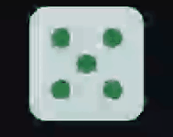
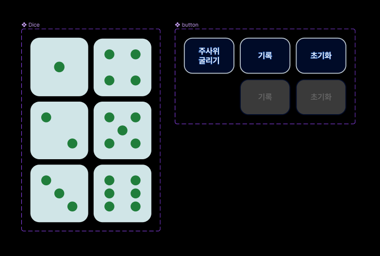

# React Homework
**주제** : Figma를 사용해 아토믹(atomic) 컴포넌트를 설계(design)한 후, 리액트 컴포넌트로 구현합니다.

## Result


## figma components


## Structure
- main.jsx
```jsx
import { StrictMode } from "react";
import * as ReactDOM from "react-dom/client";
import App from "./App";

const reactDomRoot = ReactDOM.createRoot(document.getElementById("root"));

reactDomRoot.render(
  <StrictMode>
    <App />
  </StrictMode>
);
```

- App.jsx
```jsx
import Dice from "./components/dice";
import "./App.css";

export default function App() {
  return (
    <div>
      <Dice />
    </div>
  );
}
```
- Dice.jsx
```jsx
import diceOne from "@a/dice-one.svg";
import diceTwo from "@a/dice-two.svg";
import diceThree from "@a/dice-three.svg";
import diceFour from "@a/dice-four.svg";
import diceFive from "@a/dice-five.svg";
import diceSix from "@a/dice-six.svg";
import { getRandom } from "./../utils/getRandom";

/* -------------------------------------------------------------------------- */

const diceArr = [diceOne, diceTwo, diceThree, diceFour, diceFive, diceSix]

/* -------------------------------------------------------------------------- */

export default function Dice() {
  let num = getRandom(6);
  
  let diceNum = diceArr[num]

  return (
    <div>
      
    </div>
  );
}
```